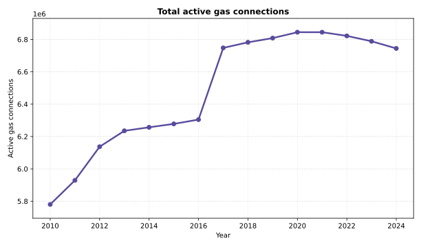
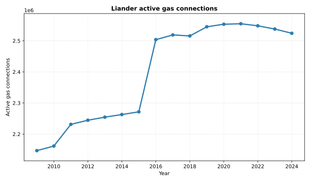
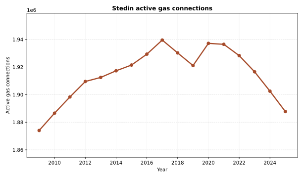
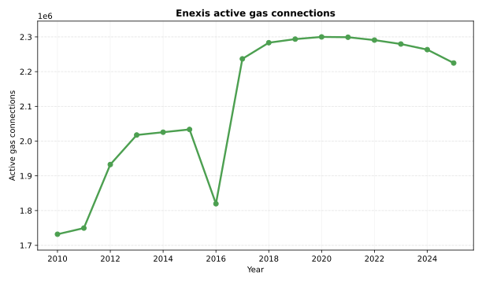
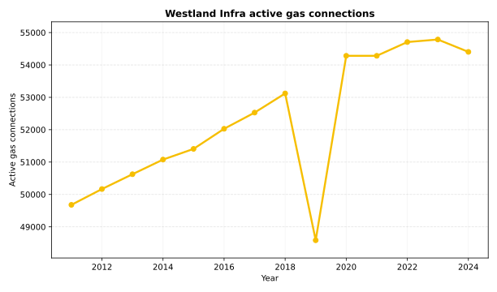

# NL DSO open data and parser

Currently the parser calculates active GAS connection per year per DSO.

The CSV files have been taken from the websites of the respective DSO's:
* https://www.liander.nl/over-ons/open-data
* https://www.enexis.nl/over-ons/open-data
* https://www.stedin.net/zakelijk/open-data/verbruiksgegevens
* https://www.westlandinfra.nl/over-westland-infra/duurzaamheid-innovaties/open-data

These pages contain "open data", but no clear license or copyright statement or waiver. Considering it is called "open data" and these companies are state owned I assume it is free to use in the sense of [official gorvernment open data](https://data.overheid.nl/en/ondersteuning/open-data/wat-is-open-data). Please contact me if that's incorrect.

The csv files have sometimes been processes to make them parseable, because originally they weren't always syntactically correct.

# Data quality
## Westland-Infra
Westland-Infra data for 2020 and 2021 are exactly the same. When I later downloaded the data again it seemed they had shuffled the files around (same files, different year assigned). Also 2019 seems odd, because from 2018 to 2019 there's a 10% drop in gas connection and then from 2019 to 2020 there's a sudden rise again to more than 2018 levels. Not sure what's up with the data, but for now it seems unreliable.

## Re-allotment Enexis and Liander
Effective 1th jan 2016 Liander took over part of Enexis' network in exchange for the then independent but Liander owned Endinet. Effective 1th jan 2017 Endinet was merged into Enexis. As a consequence part of active connections seem to move from Enexis to Liander during 2015. This influences outcomes of these two DSO's, but not their sum. However, no historical data has been found available for Endinet, so effectively it seems Enexis had a large "unexplained" increase in active connections during 2016. This makes the 2016 delta unusable.  
https://www.liander.nl/nieuws/2016/01/04/ruilverkaveling-alliander-en-enexis-een-feit

# Active Gas Connections

## Liander

## Stedin

## Enexis

## Westland Infra

# Usage
Run `uv run python main.py` to parse data, calculate results and generate the SVG graphs defined in `graph_config.yaml`.

## Connection visualizations
Graph generation is controlled through `graph_config.yaml`.
